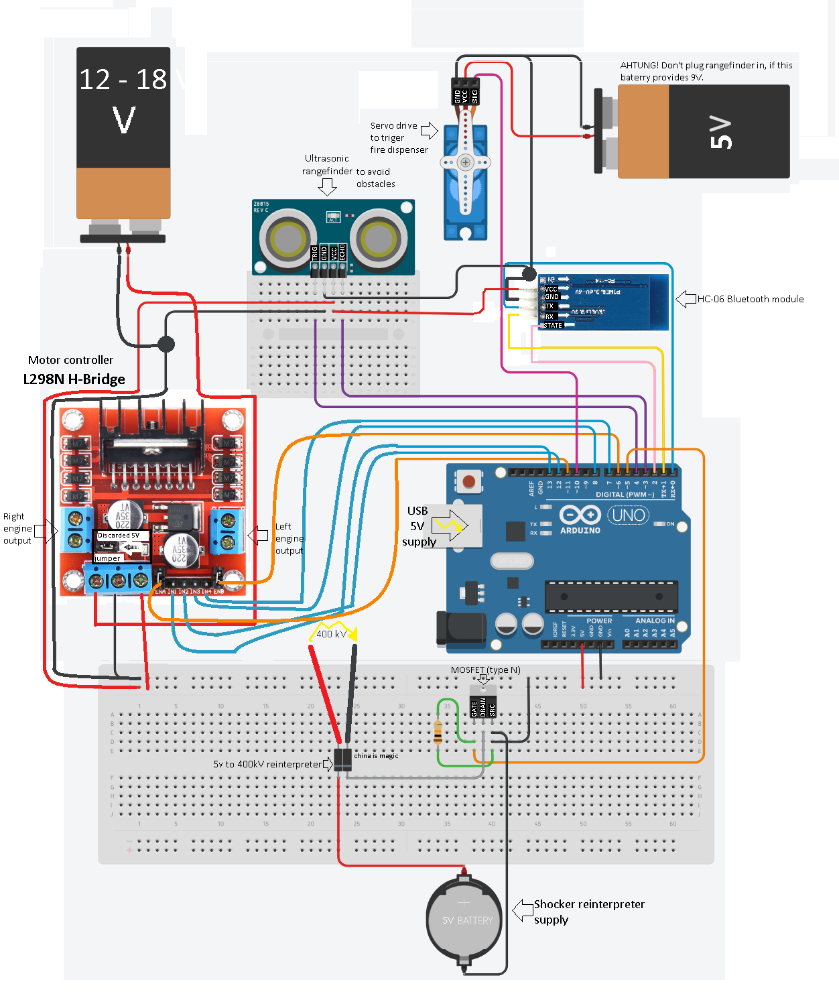
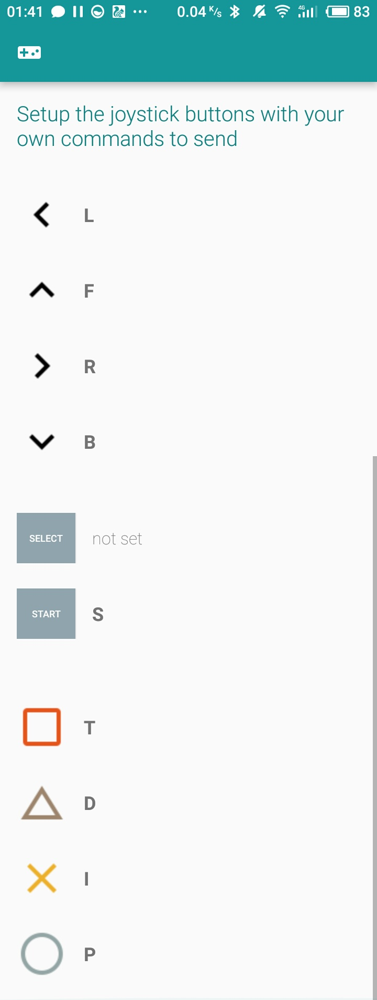

# Facking Fire Machine

© Copyright: GIY team since March 2018

## Mechatronics HOWTO

    
Detailed FFM circuit overview.

### Engines
1. Plug left and right engines power supply wires into     H-bridge OUT sockets separately and fix them with a         screwdriver.
2. Bind H-bridge input sockets to Arduino Uno pins:
    * `ENA => 11`
    * `ENB => 6`
    * `IN1 => 12`
    * `IN2 => 13`
    * `IN3 => 8`
    * `IN4 => 7`
3. Discard 5V jumper from H-bridge if your motor power supplier provides more than 12V of direct current. Consider that fact, that if you power up your engines with less then or exactly 12V you may leave this jumper and take an advantage of consuming 5V from 5V+ socket of the H-bridge (e.g. supplying Arduino Uno).
> See L298N [manual](https://tronixlabs.com.au/news/tutorial-l298n-dual-motor-controller-module-2a-and-arduino/) for more expalnation
4. Connect 12-18V direct current supplier PLUS to 12V+ socket
of H-bridge and bind its MINUS with Arduino's GND.
5. Install Arduino's 5V wire into motor controller's 5V+ socket and bind its GND socket with GND of Arduino Uno to power up the controller if you've discarded 5V jumper.
### Bluetooth
1. Bind HC-06 sockets to Arduino Uno pins:
    * `RX => 0`
    * `TX => 1`
    * `STATE => 2`
2. Bind bluetooth module VCC and GND with Arduino's 5V and GND pins.
### Servo driver
1. Bind servo's yellow input wire to Arduino Uno pin:
    * `SIG => 10`
2. Provide a supplementary 3-5V supplier for servo driver and bind its PLUS with servo's red wire and its MINUS with Arduino's GND.
3. Plug Arduino's GND wire into servo's black wire.
### 5V to 400kV converter
1. Provide a supplementary 5V supplier for this module, bind its PLUS with converer's red input wire and its GND with MOSFET's SOURCE output.
2. Bind converter's green (GND) input wire with MOSFETS's DRAIN output.
3. Connect MOSFET's SOURCE to Arduino's GND.
4. Bind MOSFET's GATE to Arduino Uno pin:
    * `GATE => 5`
### Ultrasonic rangefinder
1. Connect rangefinder's VCC and GND with Arduino's 5V and GND pins.
2. Bind rangefinder's sockets with Arduino Uno pins:
    * `TRIG => 4`
    * `ECHO => 3`

## Software HOWTO
### Arduino
* [*Download Arduino IDE for Ubuntu*](https://www.arduino.cc/en/Guide/Linux)
* [*Download the code from github.*](https://github.com/progbase/FFM)
* Plug blue Arduino USB cable into one of your PC's sockets.
* Be shure to unplug HC-06 bluetooth module from the circuit before uploading new sketch to Arduino Uno, **otherwise uploading failure has to occur**.
* Push 'Upload' button (second button with an arrow inside).
* Stay await until 'Done uploading' message has appeared, only  then you may plug HC-06 module back to the circuit.
### Android App
* [Download Arduino bluetooth controller](https://play.google.com/store/apps/details?id=com.giumig.apps.bluetoothserialmonitor&hl=ru) or other bluetooth interactive application.
* Open the app and look for `'HC-06'` device in available bluetooth devices list.
* Pair your smartphone with HC-06 module, use `1234` password
to access it.
* Connect to HC-06 in `'Controler mode'`(it's red LED stop's rapid shimmering when connection was established).

    
Open the setup menu and input the following settings.

## Driving HOWTO
Consider following key bindings:
 * `Cross`: increase engines' throttle
 * `Triangle`: decrease engines' throttle
 * `Square`: shutdown engines immediately
 * `Arrows`: change movement direction (auto auto-leveling of the steering wheel is provided)
 * `Start`: shocker strike
 * `Circle`: dispense fire

When driving backwards, FFM stops if rangefinder detects an obstacle in range of 40 centimeters to the machine's rear. Also,
beware that FFM shutdowns when it loses bluetooth connection.
You may recharge the gas can, all you need is a gas lighter filler. Just unplug *the isolenta* and fetch the gas can to fill.
Put it back when you are done with filling it with the new portion of madness.

**AHTUNG!** Don't toutch the fire dispenser, particularlly bare shocker wires, otherwise undefined behaviour.
